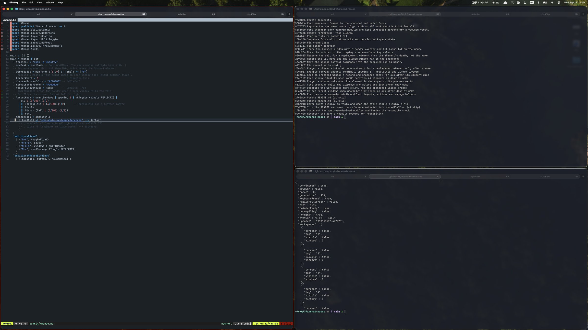
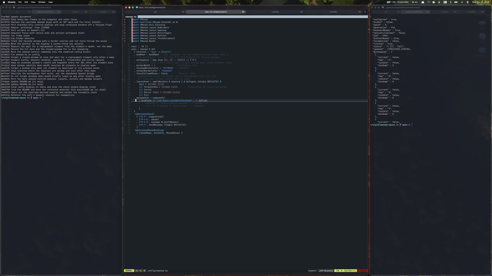
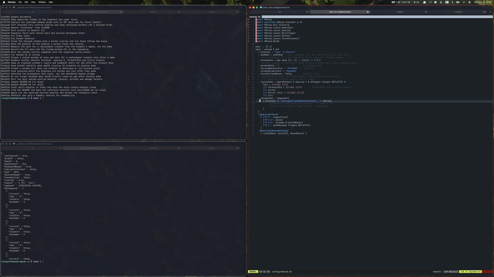

# XMonadMac

<div align="center">

</div>

[XMonad](https://xmonad.org/)'s policy core, ported to macOS. Your `xmonad.hs` is compiled as real
Haskell and drives a signed Swift helper that moves the windows.



> [!IMPORTANT]
> It is a subset, not a drop-in replacement. See [Compatibility](docs/COMPATIBILITY.md).
>
> Workspaces are **virtual** (xmonad tags such as `1`…`9` / `0`). They are
> not macOS Mission Control Desktops / Spaces. This port cannot move another
> app's window between native Spaces, so it pages windows itself.

## Screenshots

| `ThreeColMid` | `Tall`, flipped with `M-r` |
|---|---|
|  |  |

## Install

```sh
git clone <this-repo> xmonad-macos
cd xmonad-macos
make bootstrap
```

Then System Settings → Privacy & Security → Accessibility → add
`~/Applications/XMonadMac.app`, and restart it.

To update, run `make build && make install`. If the app is running,
install quits it (restoring its windows), swaps it, and relaunches it in
the same mode.

## Prerequisite

- macOS 13+
- Xcode Command Line Tools
- Homebrew

## Run

```sh
make dry-run     # read-only: logs what it would do, touches nothing
make run
```

System sleep pauses tiling and puts windows back; waking resumes it. A
session you paused yourself stays paused.

> [!CAUTION]
> Stage Manager is unsupported.

## Configure

Put your config in `~/.config/xmonad-mac/xmonad.hs` (or `~/.xmonad/`):

```haskell
import XMonad
import XMonad.Util.EZConfig
import XMonad.MacOS

main :: IO ()
main = xmonad $ def
  { terminal = "open -a Terminal"
  , modMask = mod1Mask                       -- Option
  , workspaces = map show [1..9] ++ ["0"]
  , layoutHook = Tall 1 (3/100) (1/2) ||| Full
  , manageHook = composeAll
      [ bundleId =? "com.apple.systempreferences" --> doFloat ]
  }
  `additionalKeysP` [ ("M-f", toggleFloat) ]
```

```sh
xmonad --recompile     # compile; the running engine keeps going
xmonad --restart       # run the new one
```

A compile failure never replaces the running engine.

Match windows with `bundleId`, `className`, `title`, or `subrole`. Dialogs
and floating panels are floated automatically.

> [!NOTE]
> Ported layouts and contrib modules: [Compatibility](docs/COMPATIBILITY.md).
> Paths, keys, and recovery: [Usage](docs/USAGE.md).

## Keys

`M` is Option, `S` is Shift.

| Key | Action |
|---|---|
| `M-j` / `M-k` | Focus next / previous |
| `M-S-j` / `M-S-k` | Move window down / up the stack |
| `M-Return` | Make the focused window master |
| `M-S-Return` | Launch the terminal |
| `M-h` / `M-l` | Shrink / expand the master area |
| `M-Space` | Next layout |
| `M-r` | Flip the layout left to right (bundled config) |
| `M-1…0` | Go to that **virtual** workspace |
| `M-S-1…0` | Send the window to that workspace |
| `M-f` / `M-t` | Float / unfloat |
| `M` + drag | Move (left) or resize (right) |
| `M-S-c` | Close the window |
| `M-q` / `M-S-q` | Recompile / quit |
| `Ctrl-Opt-Cmd-Esc` | Emergency stop; restores every hidden window |

## Virtual workspaces

`M-1`…`M-0` switch XMonadMac workspaces. Switching a Desktop in Mission
Control is a different, native Space and is not how this port hides windows.

Windows on other virtual workspaces are parked off-screen. An app that
refuses that (Finder) is minimized instead. `xmonad recover` puts every
WM-hidden window back.

## Commands

`make` builds; `xmonad` drives a running instance.

| | |
|---|---|
| `make bootstrap` | Toolchain, build, install |
| `make build` / `make install` | Build / install |
| `make run` / `make dry-run` | `xmonad start` / `xmonad start --dry-run` |
| `make check` | Tests |
| `xmonad start [--dry-run]` | Launch the installed app |
| `xmonad --recompile` / `--restart` | Compile the config / run it |
| `xmonad status` / `log` / `doctor` | What it is doing |
| `xmonad pause` / `resume` / `recover` | Suspend / resume / unhide |
| `xmonad autostart on` | Start at login |

The menu bar shows `1 [9] · Tall`. `xmonad status` publishes the same as
JSON, for external bars.

## Accessibility grant

Rebuilding an ad-hoc signed app asks for Accessibility again. Once:

```sh
./scripts/signing-identity.sh
```

## Documentation

- [Usage](docs/USAGE.md) — keys, paths, recovery
- [Design](docs/DESIGN.md) — policy vs helper
- [Compatibility](docs/COMPATIBILITY.md) — xmonad API subset
- [Protocol](docs/PROTOCOL.md) — NDJSON
- [Testing](docs/TESTING.md) — checks and manual matrix
- [Upstream](docs/UPSTREAM.md) — attribution

## License

BSD-3-Clause. See [LICENSE](LICENSE).
